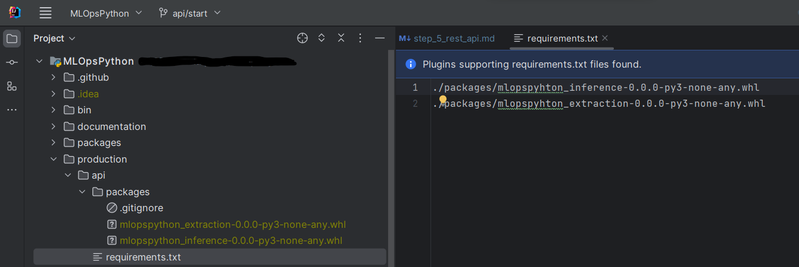

# REST API

## Introduction

### Abstract

What is MLOps? 

Where are we in the MLOps Timeline?


What is the purpose of the Deployment step? Why do we turn our model into a Webservice? 

The full content of this course [is here.](documentation/production/api_and_deployment.md)

### The tools

To develop, we will use GitHub Codespaces. We will start our development from the branch "api/start". => Demo

In Codespaces, Install Docker and Kubernetes plugins => Demo

**NEVER EVER FORGET TO STOP YOUR CODESPACES ENVIRONMENT AFTER USING IT**

To test our API, we will use Postman (https://www.postman.com/downloads/)

### Prerequisite

To have followed the previous steps of this course

To have built this project with Makefile (wheels have to be set in the production package)




## 1 - Develop a REST Webservice with FastAPI

### a - What is a REST API ? An HTTP Request ? What are GET/PUT/POST/DELETE verbs ?

A REST API is a WebService specification which is using the REST (Representational State Transfer) constraints. We will
not be exhaustive on this point in this course (more information here : https://en.wikipedia.org/wiki/Representational_state_transfer). 

In this course, we will use this terms in order to specify our WebService. It means we will create an application which
allows us to share our ML model with other web applications (in this case, our front) in real time.

These web applications will interact each others with HTTP Requests. HTTP for HyperText Transfer Protocol, is a 
client-server protocol used for web transmissions.  


*Demonstration with a Web Browser*

HTTP requests relies on verbs, bodies and URIs in order to exchange information between web applications, specially a client
and a server.

URI : The identifier of a resource
Verb : The action we want to do on a specific resource
Body : The body of the HTTP request

An example with products : 


A second one : 


Note that the format of the responses here is not specify but often, bodies are write in JSON.
Types and format can be force with Http headers.

The most useful http verbs are : 

- **GET** : To get resources
- **POST** : To create resources
- **PUT** : To update resources
- **DELETE** : To delete resources

### b - Install Postman and test it

Download Postman


Follow the installation process and then, click on *Skip and go to the app*


**Now, a Quick demonstration**

### c - Create our first route (/health) with FastAPI and Uvicorn

In this part, we will create our first http route : /health. This route, returns the actual state of our service. If it is correctly started, it returns "OK".

FastAPI is a Framework used for building APIs in Python. It brings us tools to allow us to develop our first http webservice.

Uvicorn is a Webserver for Python. It starts a fully usable web server instance in order to bring our WS to the WORLD!

Start your Codespaces environment from api/start branch. Select the branch first :


Create or restart your codespaces environment.

Now, we will make our project : 

```bash
# Ensure that your codespaces environment as full access to Makefile:
chmod 777 Makefile
# Now MAKE
./Makefile
```

Now, we install FastAPI and uvicorn.
In production/api/requirements.txt, add at the bottom of the file:
```
fastapi==0.85.0
fastapi-utils==0.2.1
uvicorn==0.18.3
```

We can add this requirements.txt in Makefile, at the bottom of the file:
```bash
pip install -r production/api/requirements.txt
```

Now make your environment fully again, or just launch the last pip command.

Lets go to the code.

First, we add a new python script where we will create our routes : index.py
To do so, we create a new python package production/api/src :


And then, we create our new file:


Now, we create our route !
```python
from fastapi import FastAPI

app = FastAPI()


@app.get("/health")
def health():
    return {"status": "OK"}

```

Note that this new route allows our clients to get the status of the service. So we use the http verb **GET**.

Now, we want to test this new route !! To do so, we need to launch a uvicorn server. To launch it, we create a new script in the root of the project: boot.py


Personally, I like to add this new script at the root of this project, because it is easier to launch scripts and unit tests from the root. It makes import management more reliable.

In boot.py, we launch the FastAPI application in a local web server, on the classic port : 8080
```python
import uvicorn

from production.api.src import index

if __name__ == "__main__":
    uvicorn.run(index.app, host="0.0.0.0", port=8080)

```

Now, we launch this script from the Terminal:


To test it, first make your codespaces process Public


Now it is Public, you can access it from you brower, or your local Postman
Copy the url of your process and paste it in your favorite tool. Then, add the route /health at the end of the url.

It should look like this :
https://blablabla-8080.preview.app.github.dev/health

And the result is :


### d - Expose our model

Now we want to expose our cats and dogs classification model. First, we take sure that we have our inference module in requirements:


We will use the code of the package to do the classification from a file.

Now, we have to create a new route in order to allow our users to send an image. First, let's talk about multipart form data.

It is a specific content type for our request body. It is very useful to send files through http.

To allows multipart in our production project, we have to add the following dependency:

```
python-multipart==0.0.6
```

And then, refresh our environment : 

```bash
pip install -r production/api/requirements.txt
```

For the purpose to keep this course easier, we will find the model we want to serve directly in our git repository, in resources (./production/api/resources/final_model.h5).
Note that is not a good practice. Normally, we have to download it from the model registry in Azure ML in the CI pipeline.

So, to create an instance of the model, we use the inference package and use these code lines :
```python
import logging
from mlopspython_inference.model_pillow import Model

Model(logging, "./production/api/resources/final_model.h5")
```

We have to add them in our index.py script. Note that to avoid performance issues, we will note create a new instance of this model for each http call.
So we create a unique model instance (singleton) directly at the startup of our FastApi application. Now, the index.py script should look like this:
```python
import logging

from fastapi import FastAPI
from mlopspython_inference.model_pillow import Model

app = FastAPI()
model = Model(logging, "./production/api/resources/final_model.h5")


@app.get("/health")
def health():
    return {"status": "OK"}

```

Now, we create our new route /upload, which allows our clients to send their images and respond the result of this classification.

Note that this time, the clients have to send information. So we will use the **POST** verb.

```python
import io
import logging

from fastapi import FastAPI, UploadFile
from mlopspython_inference.model_pillow import Model

app = FastAPI()
model = Model(logging, "./production/api/resources/final_model.h5")


@app.get("/health")
def health():
    return {"status": "OK"}


@app.post("/upload")
async def upload(file: UploadFile):
    file_readed = await file.read()
    file_bytes = io.BytesIO(file_readed)
    return model.execute(file_bytes)

```

To test your new route, restart your python application (run boot.py) and use Postman to send an image.

Do not forget to set your Codespaces Port to Public. 

In Postman, create a new Request. It is a POST request, with a body which the content type is form/data. Your part
is named "file" (because you set it in parameter of the upload method in index.py => async def upload(file: UploadFile))

Finally, your test in Postman should look like this:


### e - Unit testing

In this chapter, we will create unit tests to cover our new http routes! To do so, we need to create a new script: test_index.py.

Create it in the python package production.api.src.tests:


First, we need to create a test client from fastApi. This client allows us to simulate a client call to our WS:
```python
from fastapi.testclient import TestClient
from production.api.src import index

client = TestClient(index.app)
```

Note that the TestClient class take as attribute a FastApi application instance. We will add the one we want to test.

Now, to begin, we will only test our /health route:
```python
import unittest

from fastapi.testclient import TestClient
from production.api.src import index

client = TestClient(index.app)


class TestIndex(unittest.TestCase):
    def test_health(self):
        response = client.get("/health")
        self.assertEqual(response.status_code, 200)
        self.assertEqual(response.json(), {"status": "OK"})

```

As you can see, we create a new class that extends TestCase. In this class, we create a new method, test_health(). 
In this method, we simulate a call to our /health route by ysing the TestClient instance created before.

```python
response = client.get("/health")
```

This call returns a response on which we can do some assertions. We assert that the response code of the http response is 200 (ok) and we assert the json content returns.

Now, we test our /upload route by adding a new method, test_upload():
```python
import unittest

from fastapi.testclient import TestClient
from production.api.src import index

client = TestClient(index.app)


class TestIndex(unittest.TestCase):
    def test_health(self):
        response = client.get("/health")
        self.assertEqual(response.status_code, 200)
        self.assertEqual(response.json(), {"status": "OK"})

def test_upload(self):
    with open("./production/api/src/tests/resources/cat.png", "rb") as file:
        response = client.post("/upload", files={"file": ("filename", file, "image/png")})
        self.assertEqual(response.status_code, 200)
        self.assertEqual(response.json(), {'prediction': 'Cat', 'values': [1.0, 0.017399275675415993, 1.0]})

```

In this method, we open the image of the cat in resources (production/api/src/tests/resources). And we send it to the /upload route with the TestClient instance.

This call returns a new response. We assert the content of this response.

To run this test, please use this command from a Terminal launched from the root of the MLOpsPython project:
```bash
python -m unittest discover -s production.api.src.tests -t .
```

You should have these results:


### f - Our API with Swagger / OpenAPI

Swagger / OpenAPI is a specification to write APIs. It allows us to define a contract from the server in order to tell to clients of our Webservice how they can use it.

You have two different workflow : 
- contract first: you write your API first and you generate your code from it (swagger and openapi gives code generator in a lot of languages => Java, Python, .Net)
- code first: This is the way we chose for this course. We build our Webservice and the Swagger / OpenApi documentation is generate from it

FastApi gives us the possibility to see the swagger of our WebService automatically.

To see it, use the route /docs: 


FastAPI generates documentation with Redoc too! To test it, try the route /redoc:


It is the end of this first course. Do not forget to shut down your uvicorn server and your Codespaces environment !!

## 2 - Security of our Webservice

### a - Why we should add Security to our Webservice ?

Few arguments:
- Insure to clients that their information are safe and confidentiality
- Block reverse engineering
- Allows a high level of Service Level Agreement / Quality of Service

How a pirate should interfere in our client / server relationship ?


One first mandatory thing to do to insure security is to encrypt requests and results between clients and servers. One solution is to use the Transform
Layer Security protocol. It gives us the ability to extend HTTP to HTTP**S**.

*Demonstration with a web browser*

We will not go further on this protocol because our Cloud providers insure us this capability. But there is a simple thing we can add to our application
to maximize its security.

### b - oAuth2

We will use oAuth2. It is a security standard. Its goal is to delegate the security to an Authorization Server. It will allow clients to 
authorize themselves and to insure to the server (our application is a Resource Server in this scenario) that these clients are allowed to do some actions.


The client will authenticate himself and ask to Authorization Server a specific scope for a specific application (our Resource Server). If the credentials
of the client are correct, the Authorization Server will give him a token. This token is often time limited. The client has to give this token
to our application. Our application check that this token is correct and not expired.

### c - An example with Auth0

We will create a free tenant on Auth0 from Okta to illustrate these principles.

Create a free account on https://auth0.com/fr


In this last step, please check the advanced option in order to create your tenant in the EU

Now, our tenant is ready. We have to create a new API : 


This API represents our ML Webservice. Now, we create a scope to add permissions to the clients of this api.


Now we have to create the application which will be the client of our API.


To simplify this course, we will use the default application created by Auth0 for tests purposes. Note that it is not a good practice.

Now we add the permissions to this application:


Now we test it with postman !


*Now, let's see what we can find in a token with jwt.io (demo)*

### d - Add security to our Webservice

To ensure that our clients are using a correct oAuth2 token from our Auth0 tenant, we will use advanced features from FastAPI and an open source library.

First, we add a new dependency in the requirements.txt of our api: 

```
oidc-jwt-validation==0.3.1
```

This module allows to validate easily the token. In fact, FastAPI gives us just token and made minor validation on it, like the expiration date. 
We need to go deeper. For example, we have to validate the signature of the token, the audience and the issuer. 

Now, we refresh our environment:

```bash
pip install -r production/api/requirements.txt
```

Now, we have to make some modifications on the index.py script in order to protect our /upload route:

```python
import io
import logging
import os # this line is new

from fastapi import FastAPI, UploadFile, Depends # here, we add Depends
from fastapi.security import OAuth2PasswordBearer # this line is new
from mlopspython_inference.model_pillow import Model
from oidc_jwt_validation.authentication import Authentication # this line is new
from oidc_jwt_validation.http_service import ServiceGet # this line is new

app = FastAPI()
model = Model(logging, "./production/api/resources/final_model.h5")

oauth2_scheme = OAuth2PasswordBearer(tokenUrl="token") # this scheme comes from FastAPI. It allows to check some token information and give the token to the function

issuer = os.getenv("OAUTH2_ISSUER") # This is a value from an environment variable. It allows us to not hard code some information
audience = os.getenv("OAUTH2_AUDIENCE") # this line is new
jwks_uri = os.getenv("OAUTH2_JWKS_URI") # this line is new
logger = logging.getLogger(__name__) # this line is new
authentication = Authentication(logger, issuer, ServiceGet(logger), jwks_uri) # This object will check deeper the validity of the token
skip_oidc = False # this boolean will be used for tests purproses. By default and in production, it will be always False


@app.get("/health") # Note that this line does not change. It will not be protected
def health():
    return {"status": "OK"}


@app.post("/upload")
async def upload(file: UploadFile, token: str = Depends(oauth2_scheme)): # Take a look at this new token argument
    if not skip_oidc:
        await authentication.validate_async(token, audience, "get::prediction") # This function will validate the token
    file_readed = await file.read()
    file_bytes = io.BytesIO(file_readed)
    return model.execute(file_bytes)

```

To test this new code, you need first to add these three environment variables:
- **OAUTH2_ISSUER**: The issuer is the Authorization Server
- **OAUTH2_AUDIENCE**: The audience is the identifier of the API created in Auth0 earlier
- **OAUTH2_JWKS_URI**: This URI allows to get the public keys used to cipher the signature of the token (with Auth0, this value is .well-known/jwks.json. Just have a look of it)

To do so, you can use the linux command 'export'

Now you can boot your application, generate a new token from Auth0 with Postman and then, try to predict a cat from Postman.

It is not finish. Now you have to fix your unit tests. In fact, because we protect our /upload route, our tests do not work anymore.

So, to fix them, add these lines to your test_index.py script: 

```python
def skip_oauth():
    return {}


index.skip_oidc = True
index.app.dependency_overrides[index.oauth2_scheme] = skip_oauth
```

This code will mock the oAuth2 feature from your index.py script.
You can add it just before this:

```python
client = TestClient(index.app)
```

Now this chapter is finished. Please do not forget to terminate your Codespaces environment.